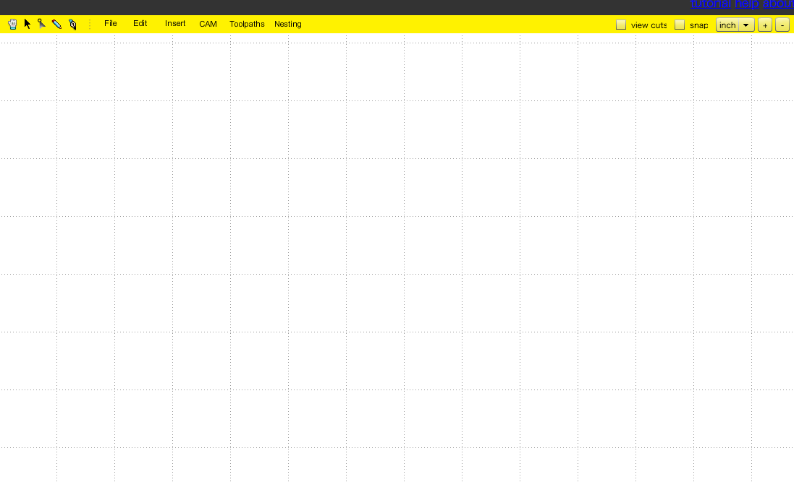
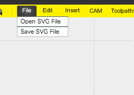
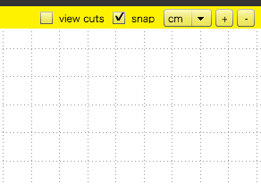
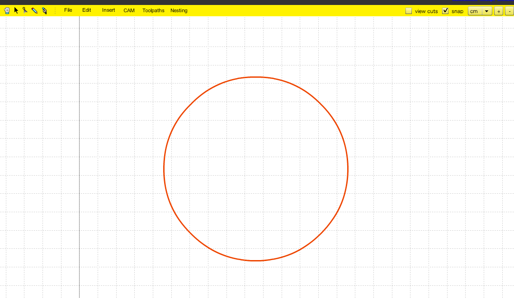
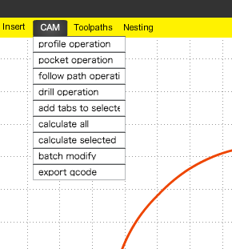
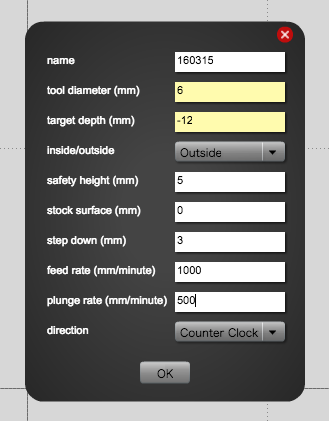
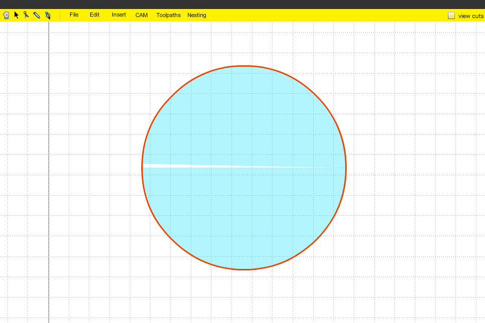
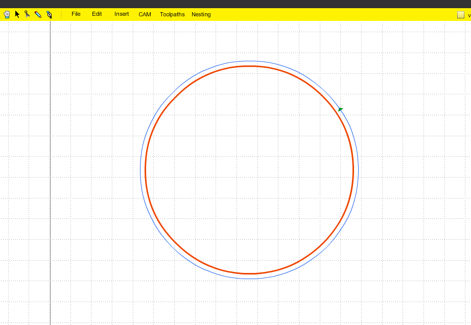
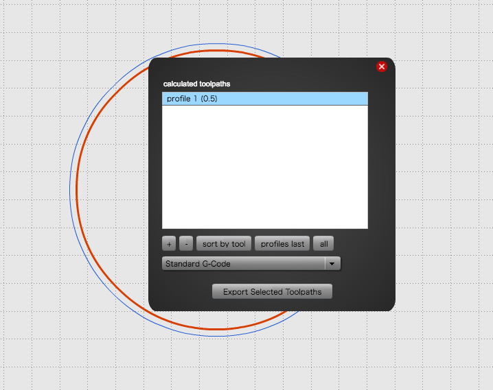

# 01.Maker CAMを使ったGコードの生成
  

 
 

Shapeko用データの作成には、[MakerCAM](http://www.makercam.com/)を使用する。 
（WEBブラウザ上で操作。バグがやや多いので要注意。） 
 
 
 

 
 

**File** > **Open SVG File** でファイルを開く。 
 
 
 

 
 

このときに、右上に表示されているグリッド単位を **"cm"** に切り替え、 **snap**にチェックを入れておく。 
 
 
 

 
 

svgデータを配置したところ。選択されているパスはオレンジ色になる。 
（今回は、Adobe Illustratorで作成した100x100mmの円（ライン:RGB000/0.1pt)をsvgデータに書き出して使用。） 
 
 
 

 
 

ツールバーの**"CAM"**をクリックすると、様々な機能が表示される。 

* **profile operation：** パスの切り抜き設定
* **pocket operation：** パス内にくぼみをつけるという設定 
（レザーカッターでいう"彫刻機能"に近い）
* **follow path operation：** パス上をドリルのセンターが通るという設定 
（通常ドリルはパスの内側又は外側を通る。）
* **drill operation：** 穴あけ設定
* **add tabs to selected：**土台とパーツをつなげておくためのブリッジをつくるための設定（※要確認）
* **calculate all：** ドリルを動かすためのパスの計算（パスのルートを考えてくれる）
* **calculate selected：** パーツ毎のパスの計算
* **batch modify：** 不明
* **export gcode：** ShapeOkoを動かすためのGコードの書き出し

 
 
 

 
 

**CAM** > **profile operation** を選択。すると下記のようなウィンドウが表示される。 

* **name：** パスの名前
* **tool diameter(mm)：** ドリル径
* **target depth (mm)：** 素材の厚み（実際には彫り込む深さを入力するので要注意）
* **inside/outside：** パスの内側外側どちらを削るのかの設定
* **safety height(mm)：** パス間移動時のドリルの高さ（5mmくらいに設定）
* **stock surface(mm)：** ???（0に設定）
* **step down(mm)：** 1回のオペレーションで彫る深さの設定（今回は2mmに設定。通常はドリル径の50%がMax。）
* **feed rate(mm/minute)：** 切削速度（1000mm/minに設定）
* **plunge rate(mm/minute)：** ドリルが垂直に下がっていくときの速度（500mm/minに設定）
* **direction：** スピンドルの回転方向の設定 
（Counter Clockwise: 反時計回り／Clockwise: 時計回り）

 
 
 

 
 

上記のとおり数値を入力し、「OK」を押す。 
そうすると設定されたパスの内部は水色に表示が変わる。 
再設定をしたい場合はツールバーの“ToolPath"から行なう。 
 
 
 

 
 

**CAM** > **calcurate all**を選択。するとドリルの進行方向が表示される。 
 
 
 

 
 

**CAM** > **Export gcode**を選択。**.nc形式** で書き出しをする。 
 
 
 
