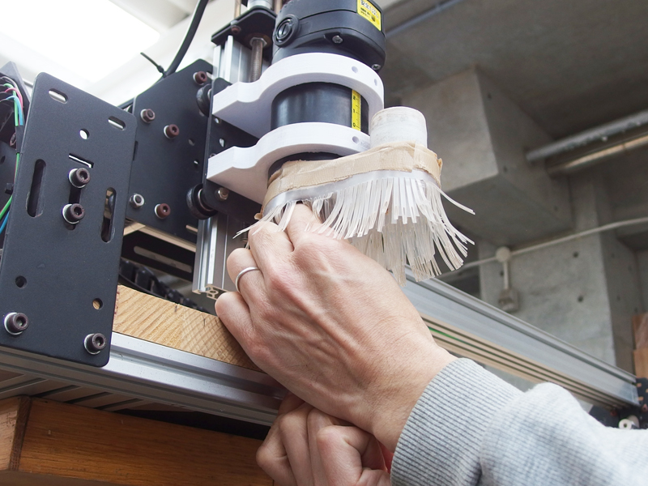
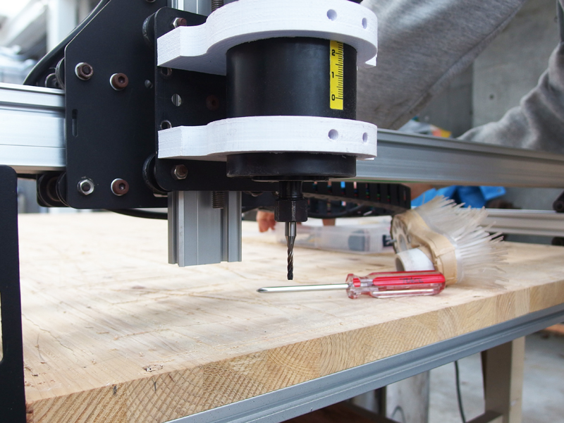
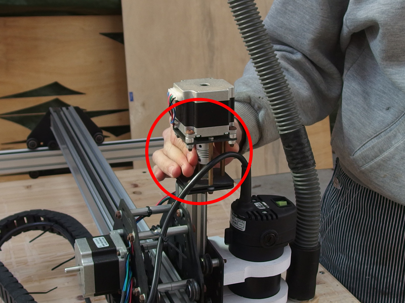

# 02.マシンのセットアップ
  

 
 

下記リンク先よりUniversal G-code Senderをダウンロードし、起動しておく。 

[https://github.com/winder/builds/tree/master/UniversalGCodeSender](https://github.com/winder/builds/tree/master/UniversalGCodeSender) 

※スタッフ小野寺のMac（OS X YOSEMITE ver.10.10.3）では 
最新版（1.0.9）がうまく動作しなかったため、1.0.7を使用。（2016.03現在） 
 
 
 

 
 

はじめに、ShapeOkoのヘッドを左手前に移動させる。 
X方向は、写真の赤ラインの位置が左の限界位置。 
 
 
 

  
 

プラスドライバーを使用してエンドミルのカバーを外す。 
 
 
 

  
 

スパナを2つ使い、エンドミル取り付け部をゆるめてエンドミルを外す。 

 
 
 

 
 

板材をShapeOkoに設置し、4ヶ所程度ビスで固定する。 
（破損を防ぐために、エンドミルを取り外した状態で板材を設置すること。） 
 
 
 

  
 

今回は、左の6mm径スクエアエンドミルを使用。 
この後に原点調整等を行なうため、エンドミルは写真の高さを参考に取り付ける。 
 
 
 

  
 

赤丸で囲まれた部分を手で回し、エンドミルを素材ギリギリの高さまで下げる。 
（だいたい3〜5mm程度のところまで。） 
 
 
 

  
 

スパナを使って取り付け部をゆるめ、エンドミルが素材に接するところまで下げる。 
高さの調整が完了したら、スパナでしっかり締める。 
 
 
 
 
 
 
