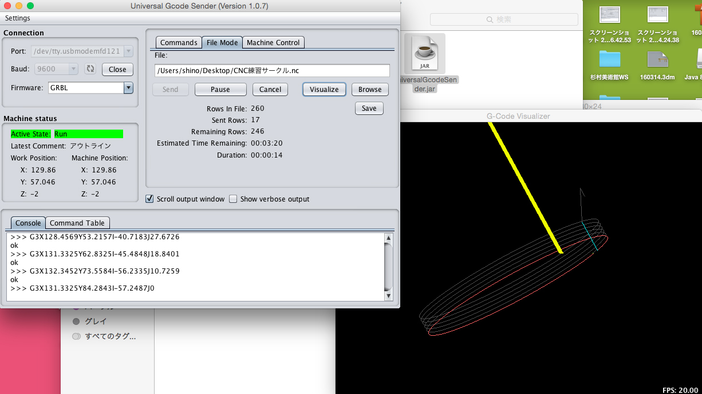

# 03.加工
  

 
 

ShapeOkoの電源ケーブルをコンセントに挿す。 
すると、下図のように黄色いモジュール内の緑色のライトが点灯する。 
これはShapeOko本体の電源を入れるだけで、 
スピンドル（ドリル部分）の電源は別に入れる必要がある。 
 
 
 

  
 

ShapeOkoをパソコンに接続し、Portを指定。 
**Baud**を **9600** に設定したら**「Open」**をクリックする。 
 
 
 

 
 

※小野寺のパソコンでは上のようなエラーが表示されたので、ターミナルで下記のコマンドを入力しました。 

***
$ sudo mkdir /var/lock

$ sudo chmod 777 /var/lock
***
 
 
 

 
 

File Modeタブの「Browse」から、加工に使用するGコードデータ（.nc形式）を開く。 
 
 
 

  
 

Machine Controlタブを開くと、エンドミルの位置を操作するパネルが表示される。 
X,Yのボタンを押し、下記の写真の位置を参考にしてShapeOkoのヘッドを移動させる。 
**「Reset Zero」**をクリックすると、移動させた位置が原点となる。 
（もしくは、Connectionを一度Closeし、再度Openしなおしても原点を設定することができる。） 
 
 
 

 
 

エンドミルのカバーを取り付ける。 
 
 
 

 
 

File Modeタブの**「Visualuze」**をクリックし、エンドミルのプロセスを表示させる。 
 
 
 

 
 

ヘッド上部の緑色のスイッチを押し、エンドミルの電源を入れる。 
 
 
 

  
 

File Modeタブの「Send」を押し、加工を開始する。 
 
 
 

 
 

加工が完了すると、経過時間が表示される。 
加工後は、ヘッドの緑色のスイッチを押し、エンドミルの電源を切る。 
 
 
 

 
 

完成！ 
 
 
 
 
 
 
